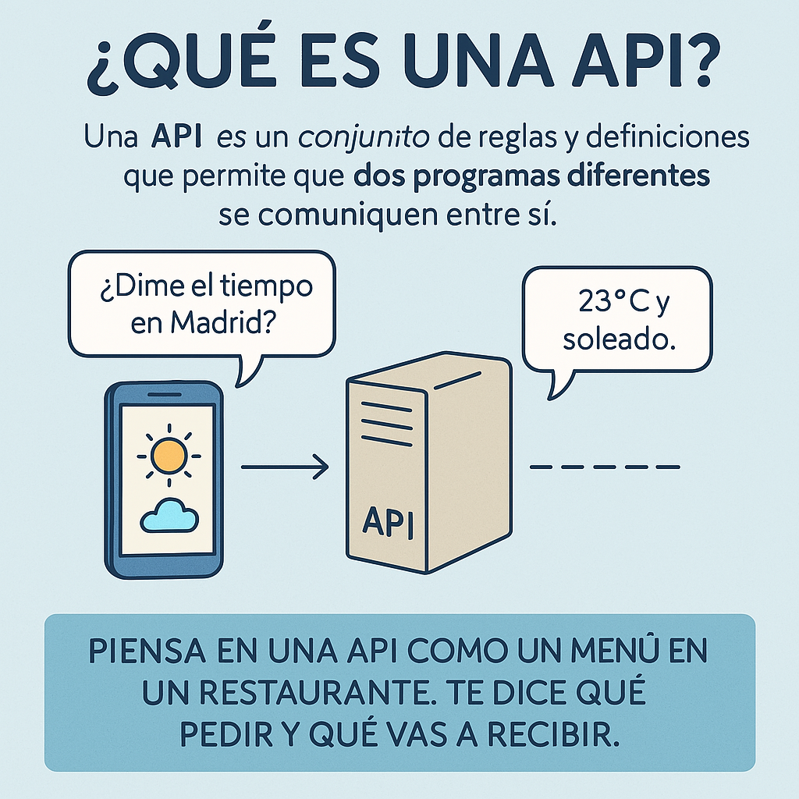

## ¿Qué es una API*

Una API *(del inglés ***Application Programming Interface***)* es un conjunto de reglas y definiciones que permite que dos 
programas o sistemas diferentes se comuniquen entre sí.

**En resumen:**  

Una API es como un contrato o un menú: te dice qué puedes pedir, cómo debes pedirlo, y qué respuesta vas a recibir.

2. ¿Para qué sirve una API?
   - Permite que una aplicación acceda a funciones o datos de otra (por ejemplo, desde una base de datos, un sistema operativo,
     o un servicio web). Oculta la complejidad interna del sistema y ofrece solo lo necesario.
   - Se usa tanto en software local *(por ejemplo, una API de Java para conectarse a base de datos)*, como en servicios web
     *(por ejemplo, una API de Google Maps o Twitter)*.

**Ejemplo sencillo:**  

Imagina una app que muestra el clima. No calcula ella misma el tiempo, sino que pide los datos a una API meteorológica, 
que le devuelve la información ya preparada.

Tipos comunes de API:
   - APIs de librerías *(como las de Java o Kotlin)*.
   - APIs de sistemas operativos (por ejemplo, para acceder al disco o la red).
   - APIs REST o Web APIs *(para comunicarse entre aplicaciones por Internet)*.

